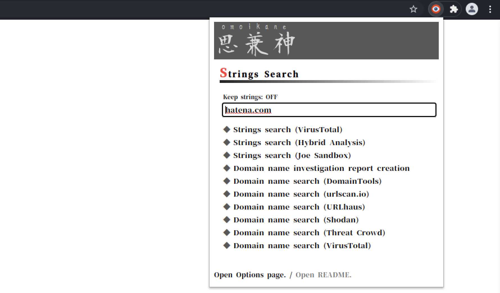

# Omoikane

OSINT support tool for malware analysts.

[- 日本語ページ -](./README_jp.md)

## Release Note

* V 1.0:
  * Initial release.

## Installation

### from Chrome Web Store

[Omoikane](https://chrome.google.com/webstore/detail/omoikane/bbedkjckljbnecoamkocbfjiijcbejik)

### from Local Files

1. Copy "Omoikane" directory to your the local.
2. Launch Google Chrome Browser.
3. Open Extensions Management Page (`chrome://extensions/`).
4. Switch on "Developer mode".
5. Click "Load unpacked" and the select "Omoikane" directory.

## Features

### General

#### Search from Context Menus

  

#### Search from Popup Menus

  

#### Defang

* Defang function for IP address and domain name.
  * for `[]` only.

#### Multi Language Support

* English, Japanse

### for Actors

* Cyber crime actor's a.k.a. search function.
  * Including Synonyms.

  

* A Malpedia Actor Page opening function via a.k.a. search results.
* Actor's details report creation function.
  * Including Synonyms, Country, Suspected State Sponsor, Suspected Victims, Target Category, Type of Incident, Description, Malware Families to Use, Reffernces.

  

### for Malware Families

* Malware family search function.
  * Including Alt Names.

  

* Malpedia malware family page opening function via malware family search results.
* Malware details report creation function.
  * Including Alt Names, Actor(s), Description, References,

  

### for IP Address

* IP Investigation report creation function (API-key required.)
  * Including Server Info, Giolocation Map, Open Ports, Proxy Check, Abuse Report Check, Reverse DNS, 

  

* IP address search with...
  * DomainTools
  * urlscan.io
  * URLhaus
  * AbuseIPDB
  * Shodan
  * Threat Crowd
  * VirusTotal

### for Domain Name

* Domain Investigation report creation function.
  * Including Whois Info, Subdomains, Resolutions, Resolution Histories

  

* Domain name search with...
  * DomainTools
  * urlscan.io
  * URLhaus
  * Shodan
  * Threat Crowd
  * VirusTotal

### for Hash value

* Hash (MD5, SHA1, SHA256) search with...
  * VirusTotal
  * Hybrid Analysis
  * ANY. RUN
  * Joe Sandbox

### for SSH Fingerprint value

* Fingerprint Search with Shodan.

### for Any other Strigs

* Strings Search with...
  * VirusTotal
  * Hybrid Analysis
  * Joe Sandbox

## Notes

### API

This extension's some functions use external REST APIs and analysis sites. Therefore function behavior is affected by dependent sites.
In addition, some attributions, especially a.k.a, may differ from some other sources. If you will use data from this extension, please confirm other sources and compare data.

### API-Key

The some REST APIs used by this extension must use an API-KEY.
Therefore, first, I recommend you to register on sites which is providing API and get an API-key.
If you didn't register the site, the IP Investigation Report Creation Function doesn't work.

* Sites that require registration.
  * [proxycheck.io](https://proxycheck.io/api/)
  * [Shodan](https://developer.shodan.io/api)
  * [AbuseIPDB](https://docs.abuseipdb.com/#introduction)

### APIs in use

* [proxycheck.io](https://proxycheck.io/api/)
* [Shodan](https://developer.shodan.io/api)
* [AbuseIPDB](https://docs.abuseipdb.com/#introduction)
* [Malpedia API](https://malpedia.caad.fkie.fraunhofer.de/usage/api)
* [ThreatCrowd API v2](https://github.com/AlienVault-OTX/ApiV2)
* [whoisproxy.info](https://chanshige.hatenablog.com/entry/2019/02/16/184907)

## Usage

### From Context Menus

1. Select strings (can use Actor name, Malware family name, IP address, Domain name, Hash value, SSH fingerprint value.)
2. Right mouse click on the browser and choose "Omoikane".
3. Select a search or report menu that you want.

### From Popup Menus

1. Click "Omoikane" icon in the extension window.
2. Input strings and click button that you want.
