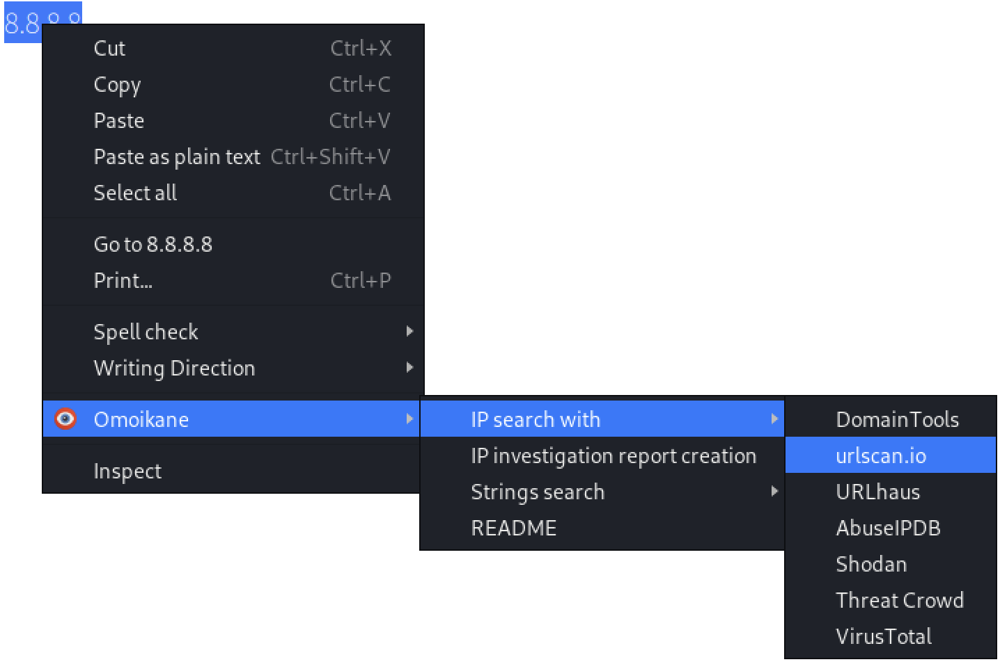
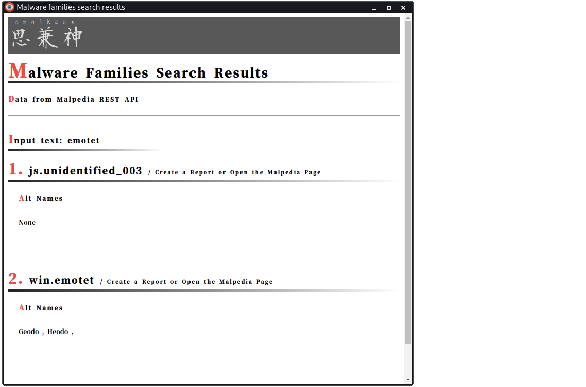
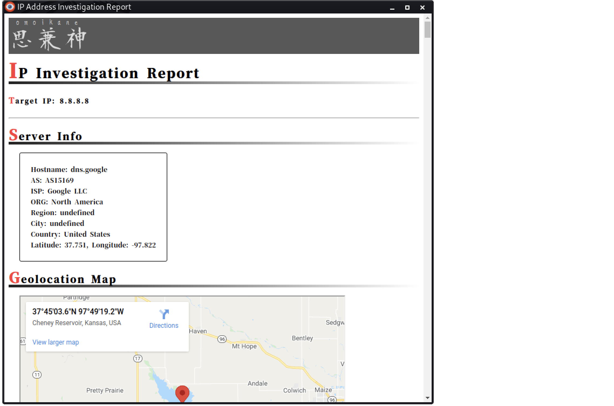
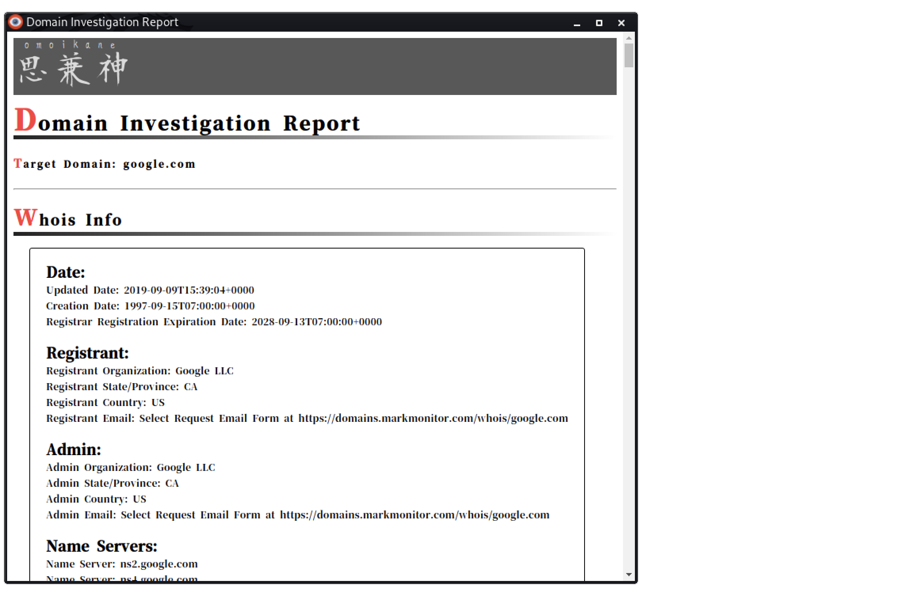

# Omoikane

マルウェアアナリスト向けのOSINTサポートツール。

[- English Page -](./README.md)

## リリースノート

* V 1.0:
  * 初回リリース。

## インストール

1. 「Omoikane」ディレクトリをローカルにコピーします。
2. GoogleChromeブラウザを起動します。
3. 拡張機能管理ページを開きます。 (`chrome://extensions/`)
4. 「開発者モード」をオンにします。
5. 「パッケージ化されていない拡張機能を読み込む」をクリックし、「Omoikane」ディレクトリを選択します。

## 特徴

### 全般

#### コンテキストメニューから検索

  

#### ポップアップメニューから検索

  

#### デファング

* IPアドレスとドメイン名のデファング機能。
  * `[]` のみ対応.

#### 多言語サポート

* 英語、日本語

### アクター名

* サイバー犯罪アクターの別名検索機能。
  * シノニム（別名）を含む。

  

* 別名検索結果から Malpedia アクターページを開く機能
* アクターの詳細レポート作成機能。
  * 同義語、国、疑わしい国のスポンサー、疑わしい犠牲者、ターゲットカテゴリ、インシデントの種類、説明、使用するマルウェアファミリ、参照を含む。

  

### マルウェアファミリー名

* マルウェアファミリー検索機能。
  * 代替名を含む。

  

* マルウェアファミリーの検索結果から Malpedia マルウェアファミリーページを開く機能。
* マルウェア詳細レポート作成機能。
  * 代替名、俳優、説明、参照を含む。

  

### IP アドレス

* IP調査レポート作成機能（APIキーが必要です。）
  * サーバー情報、ジオロケーションマップ、オープンポート、プロキシチェック、不正使用レポートチェック、逆引きDNSを含む。

  

* IPアドレス検索
  * DomainTools
  * urlscan.io
  * URLhaus
  * AbuseIPDB
  * Shodan
  * Threat Crowd
  * VirusTotal

### ドメイン名

* ドメイン調査レポート作成機能。
  * Whois情報、サブドメイン、名前解決、解決履歴を含む

  

* ドメイン名検索
  * DomainTools
  * urlscan.io
  * URLhaus
  * Shodan
  * Threat Crowd
  * VirusTotal

### ハッシュ値

* ハッシュ値検索 (MD5, SHA1, SHA256)
  * VirusTotal
  * Hybrid Analysis
  * ANY. RUN
  * Joe Sandbox

### SSH フィンガープリント

* Shodanによるフィンガープリント検索。

### その他の文字列

* 文字列検索
  * VirusTotal
  * Hybrid Analysis
  * Joe Sandbox

## 注意

### API

この拡張機能の一部の機能は、外部の REST API と分析サイトを使用します。したがって、機能の動作は依存サイトの影響を受けます。
さらに、一部の帰属、特に別名は、他のソースとは異なる場合があります。この拡張機能のデータを使用する場合は、他のソースを確認してデータを比較してください。

### API キー

この拡張機能で使用される一部の REST API は、API キーを使用する必要があります。
したがって、まず、API を提供しているサイトに登録して API キーを取得することをお勧めします。
サイトに登録していない場合、IP 調査レポート作成機能は動作しません。

* 登録が必要なサイト
  * [proxycheck.io](https://proxycheck.io/api/)
  * [Shodan](https://developer.shodan.io/api)
  * [AbuseIPDB](https://docs.abuseipdb.com/#introduction)

### 使用中の API

* [proxycheck.io](https://proxycheck.io/api/)
* [Shodan](https://developer.shodan.io/api)
* [AbuseIPDB](https://docs.abuseipdb.com/#introduction)
* [Malpedia API](https://malpedia.caad.fkie.fraunhofer.de/usage/api)
* [ThreatCrowd API v2](https://github.com/AlienVault-OTX/ApiV2)
* [whoisproxy.info](https://chanshige.hatenablog.com/entry/2019/02/16/184907)

## 使用法

### コンテキストメニューから

1. 文字列を選択します（アクター名、マルウェアファミリー名、IPアドレス、ドメイン名、ハッシュ値、SSHフィンガープリント値を使用できます）。
2. ブラウザを右クリックして「Omoikane」を選択します。
3. 必要な検索メニューまたはレポート作成メニューを選択します。

### ポップアップメニューから

1. 拡張機能ウィンドウの「Omoikane」アイコンをクリックします。
2. 文字列を入力し、必要なボタンをクリックします。
